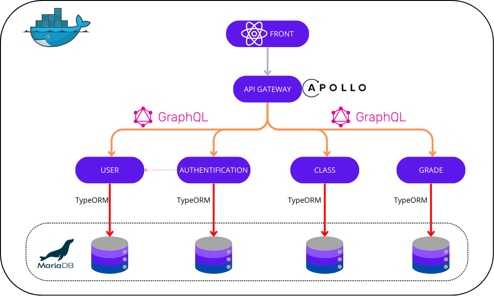

# 📚 SchooInc - Documentation Technique & Déploiement

SchooInc est une plateforme éducative moderne développée en microservices avec GraphQL, permettant la gestion des étudiants, enseignants, notes, classes, etc.


## Table des Matières

- [Technologies Principales](#technologies-principales)
- [Architecture Globale](#architecture-globale)
- [Installation & Déploiement](#installation-&-déploiement)
- [Maintenance](#maintenance)
- [Contributeurs](#contributeurs)


## 🛠️ Technologies Principales

| Outil              | Usage                                 |
|--------------------|----------------------------------------|
| NestJS             | Framework principal backend            |
| Apollo Federation 2| Gateway GraphQL & Federation           |
| GraphQL            | API entre services                     |
| Docker Compose     | Orchestration de conteneurs            |
| MariaDB            | Base de données relationnelle          |
| TypeORM            | ORM pour NestJS                        |
| Jest               | Tests unitaires backend                |

---

## 🧱 Architecture Globale



```
📦 graphql_microservice/
 ┣ 📁 front/                  → Front end client
 ┣ 📁 api_gateway/            → Apollo Gateway (fédération)
 ┣ 📁 auth_service/           → Login, register, JWT
 ┣ 📁 user_service/           → Gestion des utilisateurs
 ┣ 📁 grade_service/          → Notes et bulletins
 ┣ 📁 class_service/          → Cours, classes 
 ┣ 📁 utils/                  → Garde, décorateurs partagés
 ┣ 📄 docker-compose.yml      → Orchestration des services
 ┗ 📄 README.md               → Documentation actuelle
```

---

## ⚙️ Installation & Déploiement

### 1. Cloner le projet

```bash
git clone git@github.com:Yoann-Michon/graphql_microservice.git
cd graphql_microservice
git submodule update --init --recursive
```

> 💡 Modifier `.gitmodules` si tu as une erreur SSH en remplaçant `git@github.com:` par `https://github.com/`.

---

### 2. Lancer Docker

```bash
docker-compose up --build
```

### 3. Accès aux services back-end

API Gateway (Apollo Federation 2) :
Accès public sur http://localhost:4000/graphql

Sous-services (auth, user, grade, class) :
Ces services ne sont pas exposés directement au public.
Ils sont accessibles uniquement par le Gateway, dans le réseau interne du projet (via Docker).

| Service          | Port              |
|------------------|-------------------|
| Auth             | http://localhost:4001/graphql |
| User             | http://localhost:4002/graphql |
| Grade            | http://localhost:4003/graphql |
| Class            | http://localhost:4004/graphql |

---
## 🔐 Sécurisation

- Auth via JWT (dans `Authorization: Bearer <token>`)
- API key `x-api-key` requise pour chaque requête (vérifiée en gateway)
- Guards partagés (via `utils/`) : `JwtGuard`, `RolesGuard`, `ApiKeyGuard`

---

## 🧪 Tests

### Unitaire (backend)

```bash
npm run test
```
---

## 🔧 Exemple de fichier `.env` pour un microservice

```env
PORT=4002
API_KEY_ACTIVE=schoolinc123
JWT_SECRET=monsecret
DB_HOST=database
DB_PORT=3306
DB_USER=root
DB_PASS=example
DB_NAME=userdb
```

---

## 📡 Introspection GraphQL

**http://localhost:4000/graphql** (Gateway)

> Federation v2 permet l’exposition automatique d’un schéma unifié des sous-graphes et de la documentation des services.

---

## 🧹 Maintenance

### Rebuild total

```bash
docker-compose down -v --remove-orphans
docker-compose up --build
```

### Logs d’un service

```bash
docker-compose logs -f auth_service
```

## 👥 Contributeurs

- **[@Yoann-Michon](https://github.com/Yoann-Michon)**
- **[@AlberolaConstant](https://github.com/AlberolaConstant)**
- **SUPINFO Lyon** - Projet académique 2025

---